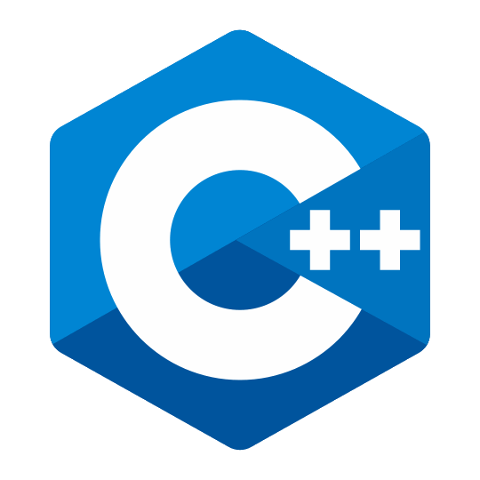
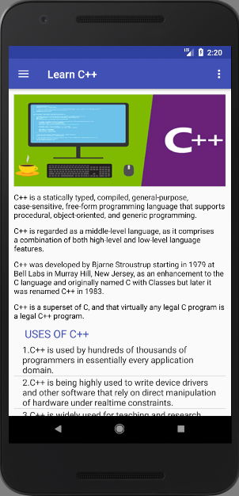
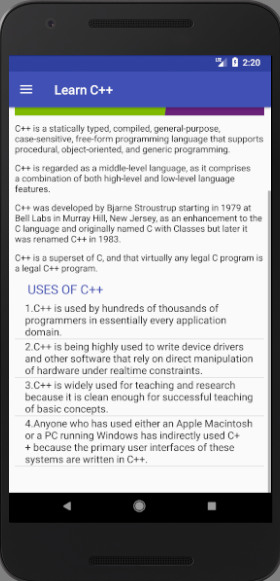
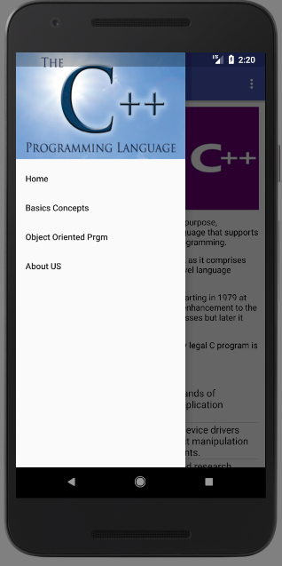
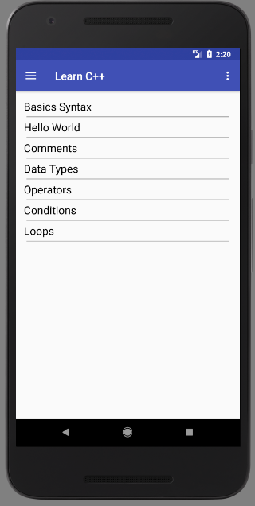
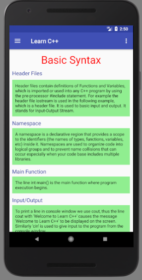
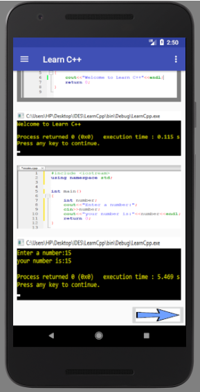
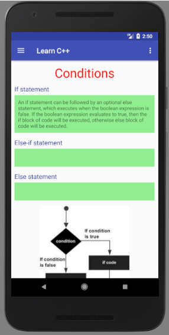
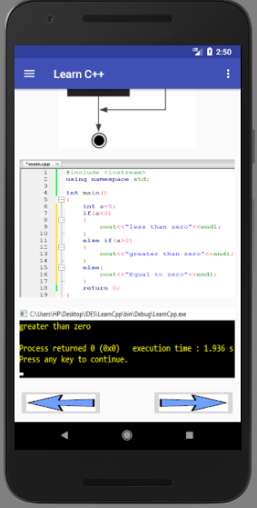

# Learn C++ App

This is my first Android Project. It is built using kotlin language and Android Studio. 
  This app teaches C++ through theory and simple C++ programs. Output of these programs are also provided.

<b>Note: </b>This app is not available in App Store.
  

<h2>ScreenShots</h2>
 

This is the App logo

  
   
  
  

  
   
  
  

  
These are the application screenshots such as: 
    <ul>
      <li>main screen</li>
      <li>navigation drawer bar</li>
      <li>list of topics</li>
      <li>sample programs and their output</li>
  </ul>  
  

